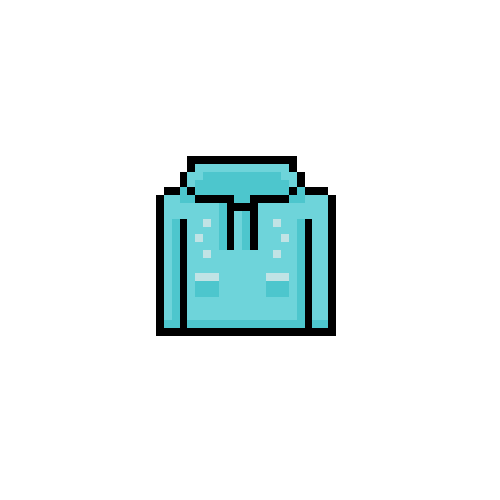
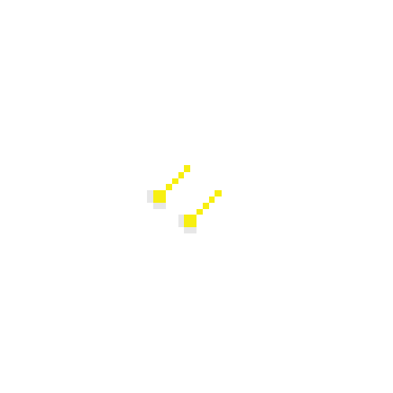

# Brick-breaking-Game

   
  
   
  <h1>만쥬의 이중생활</h1>
   

## 목차

1. [**웹 서비스 소개**](#1)
2. [**기술 스택**](#2)
3. [**주요 기능**](#3)
4. [**데모 영상**](#4)
5. [**개발 팀 소개**](#5)
6. [**개발 기간**](#6)

 

## 💁 웹 서비스 소개

건국대학교 마스코트 '만쥬'가 메인캐릭터로, 서브게임(벽돌깨기)에서 아이템 벽돌을 깨서 보석과 사다리를 얻은 후에 메인게임(사다리 멈추기)으로 보석을 가지고 탈출하는 스토리 게임입니다.
가지고 나온 보석으로 상점에서 아이템을 구매할 수 있습니다.
모든 픽셀 이미지는 포토샵으로 제작해 적용했습니다.

 

**✅ 게임 규칙** 
1) 게임 설명을 확인하고 3개로 구성된 난이도에서 원하는 게임을 선택합니다.
2) 방향키를 이용해서 서브게임인 벽돌깨기 게임을 진행합니다.
3) 벽돌을 깨면 사다리와 보석이 나오는데 움직이는 ‘만쥬’의 주머니로 이것을 받을 수 있습니다.
4) 상자나 공이 바닥에 닿거나 일정 시각이 지나면 서브게임에서 메인게임으로 넘어갑니다.
5) 배경 화면 속 노란 선 위에 사다리를 순차적으로 쌓으면 됩니다.
6) 사다리는 왼쪽에서 날아오며, 스페이스바를 누르면 사다리를 멈출 수 있습니다.
7) 사다리를 다 쌓은 후, 반드시 ‘확인’ 버튼을 눌러서 성공 여부를 판단합니다.
8) ‘확인’ 버튼을 누른 뒤, 상점으로 이동하거나 난이도를 조절할 수 있습니다.
9) ‘재시작’ 버튼을 누르면 게임을 다시 시작할 수 있는데 이는 게임 진행 중에는 불가능합니다.
10) 게임을 할 때마다 9개의 사다리가 소모되며, 최대 3개의 보석을 가져갈 수 있습니다.
11) 서브게임에서 획득한 보석을 모두 탈출시키면, 다음 난이도로 자동으로 넘어갑니다.
 

**✅ 서브게임** 

♧ 자유롭게 튕기는 만쥬의 손으로 보물상자를 열어, '사다리'와 '보석'을 수집하는 게임입니다. ♧

* 시간이 지날수록 위에서부터 보물상자가 쌓입니다.
* 제한시간이 지나거나 보물상자/손이 바닥에 닿으면 메인게임으로 넘어갑니다.
* 보물상자를 열어 나온 아이템은 만쥬가 가져온 주머니에 넣어야 획득할 수 있습니다.
* 만쥬의 손은 주머니와 닿는순간의 이동방향으로 다시 튕길 수 있습니다. 마우스를 움직여서 조절해보세요. 
※ 난이도에 따라 모을 수 있는 보석의 색깔이 달라지며, 주머니의 크기와 보물상자가 쌓이는 속도와 공의 속도가 달라집니다 ※
 

**✅ 메인게임** 

♧ 자유롭게 튕기는 만쥬의 손으로 보물상자를 열어, '사다리'와 '보석'을 수집하는 게임입니다. ♧

* 메인 게임 1회당 사용하는 사다리의 개수는 9개이며, 서브 게임에서 획득한 사다리의 개수에서 차감됩니다.
* 메인 게임 1회당 가져갈 수 있는 보석의 수는 최대 3개이고, 보석이 3개 미만일 때 가진 보석을 가져갈 수 있습니다.
* 날라오는 사다리는 space를 눌러서 멈추게 할 수 있습니다. 그렇게 9개의 사다리를 모두 배경화면 속 노란선 위에 쌓고 확인 버튼을 클릭하면 보석을 가지고 탈출할 수 있습니다.
* 스테이지마다 사다리의 속도는 다르며, 반드시 사다리 9개를 노란선 위에 쌓고 space버튼을 클릭해야만 기타 동작을 시행할 수 있습니다.
* 서브게임에서 획득한 보석을 모두 가지고 탈출하면 다음 난이도로 자동 연결됩니다. 
※ 난이도에 따라 사다리가 날아오는 속도가 달라집니다 ※
 

**✅ 상점** 

♧ 메인 게임에서 가지고 탈출한 보석을 통해 만쥬를 꾸밀 수 있는 아이템을 구매할 수 있습니다. ♧

* 아이템에 따라 필요한 보석의 종류와 수가 다릅니다.
* 스테이지에 따라 필요한 종류의 보석을 모을 수 있습니다.
* 구매를 하면 해당 보석의 개수가 차감됩니다.
* 또한, 상점에선 지금까지 모은 보석의 종류별 개수와 총 점수를 볼 수 있습니다. 총 점수는 누적된 보석 개수와 같습니다.

 

## 🛠 기술 스택

### **Front-end**

|  |  |  |
| :----------------------------------------------------------------------------------------------------------------------------: | :--------------------------------------------------------------------------------------------------------------------------: | :------------------------------------------------------------------------------------------------------------------------------- |
|                                                             HTML5                                                              |                                                             CSS                                                              |                                                       JavaScript                                                                 |

### **Version Control**

|  |
| :---------------------------------------------------------------------------------------------------------------: |
|                                                        Notion                                                     |                                                        

 

## 💡 주요 기능

|                     기능                     |                                                                                            내용                                                                                             |
| :------------------------------------------: | :-----------------------------------------------------------------------------------------------------------------------------------------------------------------------------------------: |
|     설명서                                    |                                      게임설명, 게임시작 버튼이 등장합니다.   시나리오와 보석의 종류, 각 게임별 설명서를 제공합니다.                                     |
|     메인게임                                  |                                       만쥬가 획득한 보석을 가지고 궁전 밖으로 탈출할 수 있도록 사다리 게임이 진행됩니다.  (난이도 별로 사다리의 속도가 달라집니다)                                  |
|     서브게임                                  |                                     만쥬가 성의 보물상자에서 보석과 필요한 사다리를 획득할 수 있도록 아이템 벽돌 깨기 게임이 진행됩니다.  (난이도 별로 아이템 주머니의 크기와 새로운 벽돌이 생성되는 주지가 달라집니다)                               |
|      상점                                     |                                                            각 스테이지를 통해 획득한 보석으로 만쥬를 꾸밀 수 있습니다.                                                               |
|     환경설정                                  |                                         커서와 소리 설정이 가능합니다.                                                 |

 

## 🎥 데모 영상

|                    초기화면                    |
| :--------------------------------------------: |
|  |

> 게임설명과 게임시작 버튼이 등장합니다.

|                           게임설명                           |
| :----------------------------------------------------------: |
|  |

|                                 환경설정                                  |
| :-------------------------------------------------------------------------------------------------------------------: |
|  |

> 커서 및 소리를 설정할 수 있습니다.

|                                서브게임                                |
| :------------------------------------------------------------------------------------------------: |
| |

|                            메인게임                            |
| :-------------------------------------------------------------------------------------------: |
|  |

> 게임을 시작할 때, 난이도를 선택합니다.

|                                상점                                |
| :------------------------------------------------------------------------------------------: |
|  |

 

## 👪 개발 팀 소개

<table>
  <tr>
    <td align="center">
        
    </td>
     <td align="center">
        
    </td>
     <td align="center">
        
    </td>
     <td align="center">
        
    </td>
  </tr>
  <tr>
    <td align="center">
        이윤호 (Front-end)
    </td>
    <td align="center">
        이혜리 (Front-end)
    </td>
    <td align="center">
        편강 (Front-end)
    </td>
    <td align="center">
        황우진 (Front-end)
    </td>
</table>

 

|  이름  |   역할    |                                                                                                                                                                           개발 내용                                                                                                                                                                            |
| :----: | :-------: | :------------------------------------------------------------------------------------------------------------------------------------------------------------------------------------------------------------------------------------------------------------------------------------------------------------------------------------------------------------: |
| 이윤호 | Front-end | 서브게임 개발 GameStart페이지 개발 게임 일부 아이템 디자인|
| 이혜리 | Front-end | 초기화면 SelectLevel,StartPage,Explanation 개발 환경설정 화면 개발 게임 일부 아이템 디자인|
| 편 강 | Front-end | 상점 개발 환경설정에 따른 bgm 및 커서 적용  게임 아이템 디자인 및 제작 (포토샵)|
| 황우진 | Front-end | 메인게임 개발 화면전환 코드작성 및 전체적인 코드통합 게임 일부 아이템 디자인|

 

## 📅 개발 기간

23.5.01. ~ 23.6.01. (31일)

 
